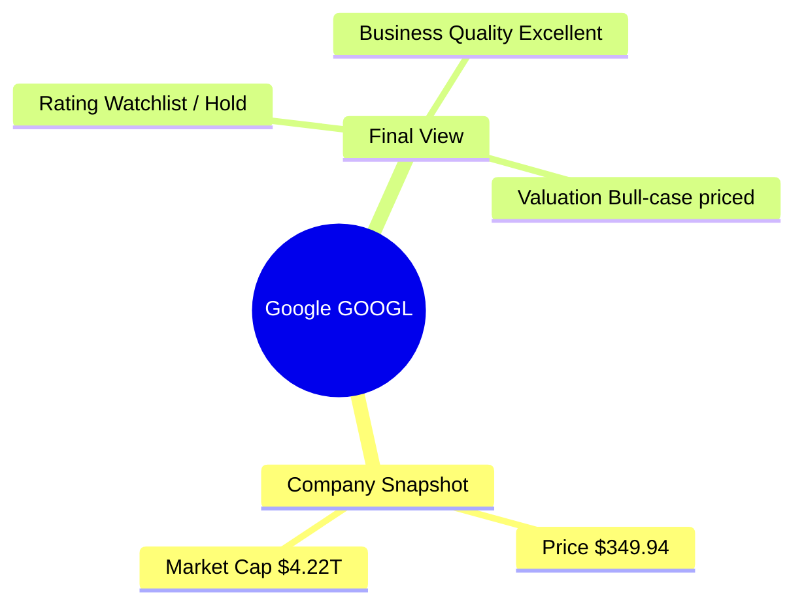

# Mind Map Output Policy

## Purpose

Investment analysis should not only produce a long-form report. It should also produce a mind-map-friendly summary that helps users quickly understand:

- The main conclusion
- Key valuation drivers
- Key risks
- Decision logic
- Investor action suggestions
- What to monitor next

The goal is to improve readability and decision clarity.

---

## Core Principle

The report should support two output layers:

1. **Detailed Analysis Layer**
   - Full report
   - Tables
   - Source annotations
   - Valuation logic
   - Execution gate checklist

2. **Mind Map Summary Layer**
   - Hierarchical structure
   - Short phrases instead of long paragraphs
   - Clear parent-child relationships
   - Designed to be readable as:
     - markdown nested bullets
     - indented tree
     - Mermaid mindmap syntax
     - concept map outline

---

## Required Mind Map Root

Every stock analysis should have the following top-level nodes:

- Company Snapshot
- Final View
- Business Quality
- Valuation
- Reverse DCF / Market Expectations
- Risks
- Execution Gate Status
- Investor Action Framework
- Key Monitoring Points

---

## Mind Map Design Rules

### 1. Keep nodes short

Prefer:

```text
Search moat strong
Cloud growth accelerating
AI CapEx high
```

Avoid:

```text
The company appears to continue benefiting from a durable search moat while cloud growth remains relatively strong.
```

### 2. Use hierarchy

Example:

```text
Valuation
├─ Base value
├─ Bull value
├─ Current price
└─ Margin of safety
```

### 3. Highlight decision logic

Example:

```text
Final View
├─ Good company
├─ Price not cheap
└─ Watchlist / Hold
```

### 4. Separate fact / judgment / action

Example:

```text
Fact
├─ Revenue growth 22%
├─ FCF 64B
Judgment
├─ High-quality compounder
Action
├─ Empty position: wait
```

### 5. Keep output compact

The mind map layer should be short enough to fit on one screen for L0/L1 mode and one page for L2 mode.

---

## Standard Output Forms

### Form A: Nested Bullet Mind Map

```markdown
## Mind Map Summary

- Google (GOOGL)
  - Company Snapshot
    - Current price: $349.94
    - Market cap: $4.22T
  - Final View
    - Rating: Watchlist / Hold
    - Business quality: Excellent
    - Valuation: Bull-case priced
  - Valuation
    - Bear: $95
    - Base: $207
    - Bull: $411
```

### Form B: ASCII Tree

```text
Google (GOOGL)
├─ Company Snapshot
│  ├─ Price: $349.94
│  └─ Market cap: $4.22T
├─ Final View
│  ├─ Rating: Watchlist / Hold
│  └─ Valuation: Bull-case priced
```

### Form C: Mermaid Mindmap



Use Mermaid when environment supports it; otherwise use nested bullets or ASCII tree.

---

## Required Section

Every standard stock report should include:

```markdown
## Mind Map Summary
```

before or near the final conclusion.

---

## Mind Map + Detailed Report Relationship

The mind map is not a replacement for the detailed report.

It is a compact front-end summary of:

- final conclusion
- evidence hierarchy
- action hierarchy
- what matters most

---

## Required Node Contents

### Company Snapshot
- Ticker
- Current price
- Market cap
- Analysis date
- Style classification

### Final View
- Rating
- Business quality
- Valuation attractiveness
- Risk level

### Business Quality
- Moat
- Growth
- Financial quality
- Management / capital allocation

### Valuation
- Primary model
- Base value
- Bear value
- Bull value
- Margin of safety

### Reverse DCF
- Implied growth
- Whether expectations are high / reasonable / low

### Risks
- Top 3-5 risks

### Execution Gates
- Freshness
- Provenance
- Valuation
- Reverse DCF
- Margin of safety

### Investor Action Framework
- Empty position
- Half position
- Full position
- Overweight

### Monitoring Points
- Most important metrics/events to track

---

## Compression Rules

For L0 / L1 mode:

- 1 root
- 8-10 main branches
- 2-5 leaf nodes per branch

For L2 / L3 mode:

- same root branches
- more detail allowed
- may include a second-level evidence branch

---

## Blocking Rule

If full valuation is blocked, the mind map must explicitly show blocked nodes.

Example:

```text
Valuation
├─ Status: Blocked
└─ Reason: Missing latest FCF
```
